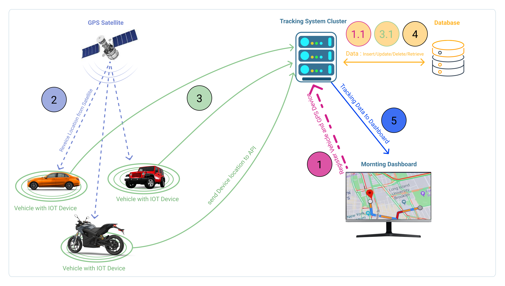
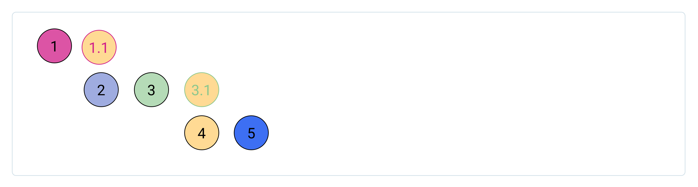
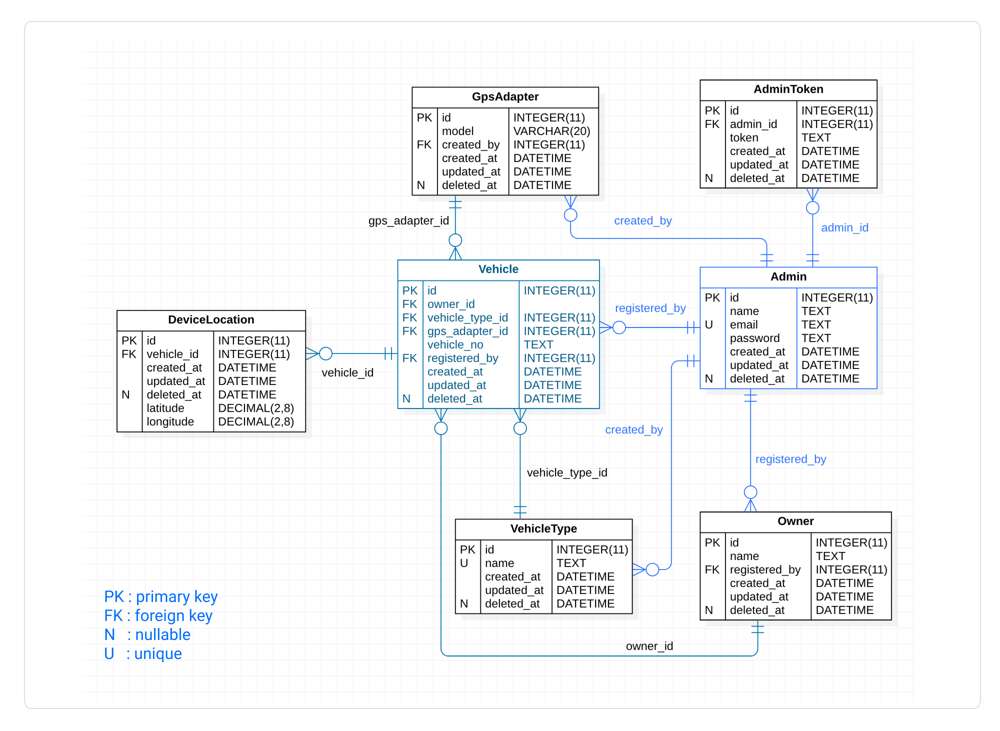

 

# Vehicle Tracking System - FullStack
FullStack Vehicle Tracking System (Include API for Vehicle and API for Admin as well as Dashboard)  

### Built With

as the main language, I use the following:

* [Next.js](https://nextjs.org/) For Admin Dashboard
* [NodeJs](https://nodejs.org/en/) For admin API and vehicle API

(<a href="#top">back to top</a>)

## File Structure

- [x] [database](https://github.com/helloakn/VehicleTrackingSystem-FullStack/tree/main/database) 
- [x] [documentations](https://github.com/helloakn/VehicleTrackingSystem-FullStack/tree/main/documentations) 
- [ ] [programs](https://github.com/helloakn/VehicleTrackingSystem-FullStack/tree/main/programs) 
    - [admin_dashboard](https://github.com/helloakn/VehicleTrackingSystem-FullStack/tree/main/programs/admin_dashboard) 
    - [api](https://github.com/helloakn/VehicleTrackingSystem-FullStack/tree/main/programs/api) 

(<a href="#top">back to top</a>)

### Data Model
IOT device will send location to API

### Data Flow in Sequence

### Symbol Description

### ERD

### Colud Archiecture
It is just for sample.

## Acknowledgments
Thanks for visiting to my github repo. :)
